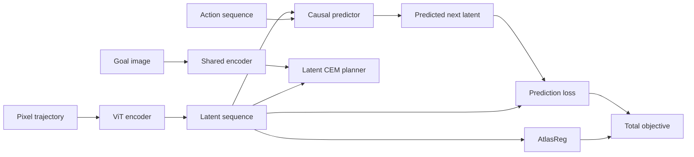

# AtlasWM

**End-to-end joint-embedding predictive world models with structured characteristic-function regularization**

[](https://github.com/darvyc/AtlasWM/actions/workflows/ci.yml)
[](https://www.python.org/)
[](CHANGELOG.md)
[](LICENSE)

AtlasWM is a compact Joint-Embedding Predictive Architecture for learning action-conditioned latent dynamics directly from pixels. It combines a vision transformer encoder, a causal action-conditioned predictor, and AtlasReg, a structured distribution-matching objective based on empirical characteristic functions.

The release provides:

- a mathematically identifiable population objective;
- finite-sample biased and unbiased estimators;
- structured spherical projection rules with exact low-degree cubature;
- Gaussian and Student-t latent targets;
- quadrature and exact Gaussian closed-form backends;
- one-dimensional and multivariate subspace objectives;
- latent-space planning with the Cross-Entropy Method;
- theorem-linked tests, reproducibility instructions, and a fixed-budget benchmark protocol.

AtlasWM builds on the end-to-end JEPA formulation developed in [LeWorldModel](https://arxiv.org/abs/2603.19312) and the isotropic-latent perspective developed in [LeJEPA](https://arxiv.org/abs/2511.08544).

## Abstract

Let `P` denote the learned latent distribution and `Q` a target distribution. AtlasReg minimizes a sliced characteristic-function discrepancy

$$
\mathcal{D}_w(P,Q)
=
\int_{\mathbb{S}^{d-1}}\int_{\mathbb{R}}
w(t)\left|\varphi_P(tu)-\varphi_Q(tu)\right|^2
\,dt\,d\sigma(u).
$$

For an integrable weight satisfying `w(t) > 0` almost everywhere, the population objective is non-negative and equals zero exactly when `P = Q`. Training replaces the population distribution, sphere integral, and frequency integral with a minibatch estimator, a structured direction rule, and numerical quadrature or a Gaussian closed form.

The default projection rule is a Haar-rotated cross-polytope. Its full `2d` vertices form a spherical 3-design. For symmetric target characteristic functions, antipodal directions produce identical squared discrepancies, so AtlasReg evaluates `d` distinct projection lines without altering the objective. At `d = 192`, this gives 192 structured projection evaluations per step.

## Architecture



The training objective is

$$
\mathcal{L}
=
\mathcal{L}_{\mathrm{pred}}
+
\lambda_{\mathrm{reg}}\mathcal{L}_{\mathrm{AtlasReg}},
$$

with

$$
\mathcal{L}_{\mathrm{pred}}
=
\frac{1}{B(T-1)}
\sum_{b,t}
\left\|\widehat z_{b,t+1}-z_{b,t+1}\right\|_2^2.
$$

Action `a_t` conditions latent `z_t` when predicting `z_{t+1}` in both teacher-forced training and autoregressive planning.

## Statistical specification

| Component | Specification |
|---|---|
| Population metric | Sliced weighted characteristic-function distance |
| Projection rules | Rotated cross-polytope, regular simplex, iid Haar |
| Default projection count | `d` distinct antipodal lines |
| Targets | Standard Gaussian, scaled univariate Student-t |
| Finite estimator | Biased non-negative V-statistic or unbiased U-statistic |
| Frequency backend | Trapezoidal quadrature or exact Gaussian BHEP form |
| Frequency weight | Single-scale or two-scale Gaussian mixture |
| Matching mode | Raw target matching or studentized shape testing |
| Subspace mode | 1D projections or k-dimensional Gaussian BHEP |
| Planning | Receding-horizon CEM in latent space |

## Formal guarantees and scope

| Statement | Status |
|---|---|
| The full spherical and frequency objective identifies `P = Q` | Proven under a positive integrable frequency weight |
| The cross-polytope integrates spherical polynomials through degree 3 | Exact |
| A Haar-rotated orthonormal basis is unbiased for spherical averages | Exact in rotation expectation |
| Antipodal projection pairs are redundant for symmetric-target squared CF loss | Exact |
| The biased Gaussian estimator has a known finite-sample null floor | Exact |
| The Gaussian-weighted objective admits a closed BHEP form | Exact |
| A finite set of directions and frequencies identifies every distribution | Not asserted |
| Global optimization avoids every collapsed stationary point | Not asserted |
| AtlasWM outperforms external world-model baselines on every environment | Not asserted |

The complete derivations, counterexamples, estimator identities, and complexity bounds are in [`docs/theory.md`](docs/theory.md).

## Installation

```bash
git clone https://github.com/darvyc/AtlasWM.git
cd AtlasWM
python -m pip install --upgrade pip
pip install -e ".[dev]"
```

Requirements:

- Python 3.10 or later
- PyTorch 2.0 or later
- SciPy for Student-t characteristic functions

## Quickstart

```python
import torch

from atlaswm import AtlasRegConfig, AtlasWM

model = AtlasWM(
    img_size=64,
    patch_size=8,
    embed_dim=192,
    action_dim=2,
    history_length=8,
    encoder_depth=4,
    encoder_heads=3,
    predictor_depth=4,
    predictor_heads=8,
    reg_config=AtlasRegConfig(
        design="cross_polytope",
        rotate=True,
        deduplicate_antipodes=True,
        target="gaussian",
        standardize_1d=False,
        estimator="biased",
        one_d_backend="quadrature",
        kernel="two_scale",
        subspace_dim=1,
    ),
)

observations = torch.randn(4, 8, 3, 64, 64)
actions = torch.randn(4, 8, 2)

losses = model.training_step(observations, actions, lambda_reg=0.1)
losses["total"].backward()

print({name: float(value) for name, value in losses.items()})
```

Train the included synthetic visual-dynamics environment:

```bash
atlaswm-train --config configs/default.yaml
```

Plan towards a visual goal:

```python
from atlaswm.planning import CEMPlanner

planner = CEMPlanner(
    model,
    horizon=5,
    n_samples=300,
    n_iters=30,
    n_elites=30,
)

action_sequence = planner.plan(current_observation, goal_observation)
```

## AtlasReg configurations

### Gaussian target matching

Raw projections constrain location, scale, and distributional shape.

```python
AtlasRegConfig(
    target="gaussian",
    standardize_1d=False,
    estimator="biased",
)
```

### Studentized shape testing

Projection-wise studentization removes batch location and scale.

```python
AtlasRegConfig(
    target="gaussian",
    standardize_1d=True,
    estimator="biased",
)
```

This objective tests standardized marginal shape. It does not enforce latent covariance `I`.

### Unbiased finite-sample estimator

```python
AtlasRegConfig(
    target="gaussian",
    standardize_1d=False,
    estimator="unbiased",
)
```

The U-statistic has the correct population expectation and may be negative on an individual finite batch. Batch-dependent standardization and whitening are intentionally incompatible with this estimator.

### Exact Gaussian closed form

```python
AtlasRegConfig(
    target="gaussian",
    one_d_backend="closed_form",
    kernel="single",
    lambda_=1.0,
)
```

This backend integrates all frequencies analytically and costs `O(MN^2)`.

### Multivariate BHEP and Henze-Zirkler mode

```python
AtlasRegConfig(
    subspace_dim=4,
    n_subspaces=4,
    target="gaussian",
    whiten_kd=True,
    hz_beta=None,
)
```

`hz_beta=None` selects the classical sample-size-dependent Henze-Zirkler bandwidth. A fixed positive value defines a fixed-bandwidth BHEP discrepancy.

### Unit-variance Student-t target

```python
from atlaswm.statistics import student_t_unit_variance_scale

nu = 5.0
config = AtlasRegConfig(
    target="student_t",
    student_t_nu=nu,
    student_t_scale=student_t_unit_variance_scale(nu),
)
```

For `nu > 2`, the scale factor is

$$
s=\sqrt{\frac{\nu-2}{\nu}}.
$$

## Verification and reproducibility

Run the complete test suite:

```bash
pytest
```

Reproduce the principal statistical identities:

```bash
python scripts/reproduce_statistics.py \
  --seed 42 \
  --dim 8 \
  --samples 128 \
  --trials 128 \
  --output outputs/statistical_verification.json
```

Run the regularizer benchmark:

```bash
python scripts/bench.py --dim 192 --batch-size 512 --n-iters 100
```

The repository defines an evidence protocol for control experiments, latent diagnostics, compute accounting, statistical reporting, and ablations. See:

- [`REPRODUCIBILITY.md`](REPRODUCIBILITY.md)
- [`docs/benchmark_protocol.md`](docs/benchmark_protocol.md)
- [`MODEL_CARD.md`](MODEL_CARD.md)
- [`paper/atlaswm.md`](paper/atlaswm.md)

## Repository layout

```text
AtlasWM/
├── atlaswm/
│   ├── designs.py             # Spherical designs and Haar rotations
│   ├── statistics.py          # ECF, BHEP, HZ, null-floor, moment identities
│   ├── targets.py             # Gaussian and Student-t characteristic functions
│   ├── kernels.py             # Frequency quadrature and Gaussian weights
│   ├── regularizer.py         # AtlasReg objective
│   ├── encoder.py             # Vision transformer encoder
│   ├── predictor.py           # Causal action-conditioned predictor
│   ├── model.py               # End-to-end world-model objective
│   ├── planning/              # Latent CEM planner
│   └── data.py                # Synthetic trajectory environment
├── configs/                   # Reproducible experiment configurations
├── docs/
│   ├── theory.md              # Mathematical foundations
│   └── benchmark_protocol.md  # Fixed-budget empirical protocol
├── paper/                     # Technical manuscript and bibliography
├── scripts/                   # Training, benchmarking, verification
├── tests/                     # Unit, mathematical, and integration tests
├── MODEL_CARD.md
└── REPRODUCIBILITY.md
```

## Citation

```bibtex
@software{cana2026atlaswm,
  author  = {Darvy Cana},
  title   = {AtlasWM: Structured Characteristic-Function Regularization for End-to-End JEPA World Models},
  year    = {2026},
  version = {1.0.0},
  url     = {https://github.com/darvyc/AtlasWM}
}
```

Machine-readable citation metadata is available in [`CITATION.cff`](CITATION.cff).

## Acknowledgements

AtlasWM builds on the JEPA, LeJEPA, and LeWorldModel research programmes and on the statistical literature concerning Cramer-Wold identification, empirical characteristic functions, spherical designs, BHEP discrepancies, and affine-invariant normality testing.

## License

AtlasWM is released under the MIT License. See [`LICENSE`](LICENSE).